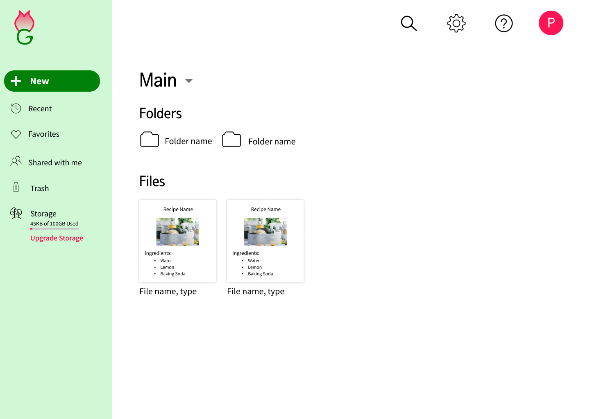

# Modern-Garden

Modern Garden is a cloud storage application where users can store and share their all-natural, DIY health recipes.

I conducted the research to determine what niche market to enter into for a cloud storage app and what features to include in the app. Through User Surveys, Personas, Stories, and Flows, I discovered the target audience and how they would use the app. I also undertook all of the branding, summarized it in a Style Guide, and implemented the UI via Wireframes, Hi-Fi Mockups, Prototypes, and User Testing of those deliverables.

[Figma File](https://www.figma.com/file/OA1csEPMTnuusKrSXmTonY/Cloud-Storage-Hi-Fi-Mockups-3rd-Iteration?node-id=0%3A1)      |     [Invision Prototype](https://invis.io/5VQP974DJZM) 

